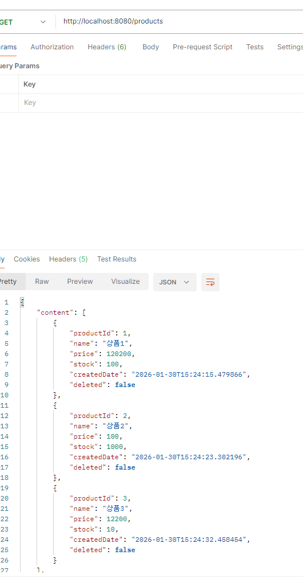
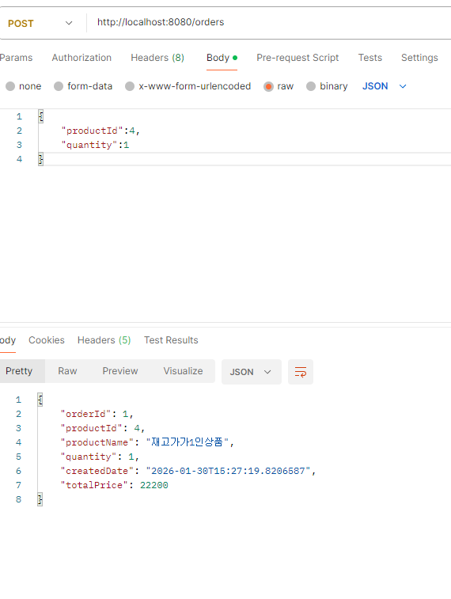
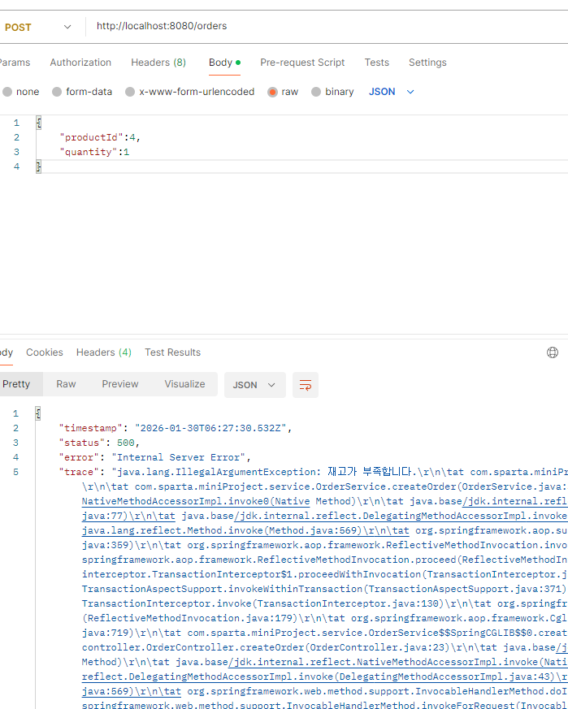

## 내일배움캠프 사전캠프  ##
### MiniProject - 상품/주문CRUD 구현
- - -
# 1. 목표
### 상품과 주문간의 관계를정의하고 기본적인 CRUD 를 구현할수 있어야합니당
* ### 프로젝트 세팅완료 (DB 연결 포함) `YES`
* ### 상품 CRUD 동작 확인 완료 - `YES`
* ### 주문 생성 동작 확인 완료 - `YES`
* ### 주문 조회 동작 확인 완료  - `YES`
* ### (도전) 주문 목록 조회 구현 - `YES`
* ### (도전) 주문 목록 조회시 N+1 문제 해결 - `YES`
* ### (도전) 상품 재고 차감 구현 - `YES`
* ### (도전) 상품 재고 원자적 차감 구현 -`YES`
### 주문 목록 조회를 실행하신 후 실행 응답에 대한 스크린 샷 1장을 올려주세요.

### 재고 1인 상품에 대해 주문을 2번 시도했을 때 결과가 어떻게 되는지에 대한 스크린 샷 1장을 올려주세요.
#### 첫번쨰 주문

#### 두번쨰 주문


# 2. 변경 이력
| 날짜         | 변경내용                                              | 비고        |
|------------|---------------------------------------------------|-----------|
| 2026-01-27 | 초안 작성                                             | 
| 2026-01-28 | CRUD 작성 완료 , 조회 전체 QueryDSL 구현 , 페이징  구현 + 확장성 고려 | 미니 점검지 제출 |
| 2026-01-29 | README 작성 , products 테스트 작성 + 통과 완료               |  |   
| 2026-01-30 | orders 테스트 작성 + 통과완료 postman 통과 완료 , Docker and CI/CD  구현진행                |            |
| 2026-01-31 |                                                   |
 2026-02-01 |                                                   |           |
| 2026-02-02 |                                                   |
| 2026-02-03 |                                                   | 중간 점검

# 3. 기능 설계
| 기능 | 세부 기능                                     | 설명 |       
|----|-------------------------------------------|---|
| 상품 | 상품등록 , 상품 목록조회 , 상품 단건조회 상품 변경, 상품 삭제     |   |
| 주문 | 주문 생성(상품수 감소) , 주문 단건 조회, 주문 목록 조회, 주문 취소 |   |
 
# 4. API 명세서
## 1. 사용자 관련 API
* ### 상품 Entity
```
Long id                     // ID번호
String name                 // 상품 이름
Long price                  // 상품 가격
Long stock                  // 상품 개수 (남은개수)
boolean deleted             // 상품 삭제 (등록 취소) 기본 false
LocalDateTime createDate    // 상품 등록(생성) 일
```
* ### 주문 Entity
```
Long id                     // ID번호
Product product             // 상품과 ManyToOne 관계
Long quantity               // 주문 수량 (처음에는 1 그다음에 확장성 고려)
boolean deleted             // 주문 취소 (softdelete) 기본 false
LocalDateTime deletedAt     // 주문 취소 날짜

```
* ## `POST /products` : 상품 등록
  * URL : GET /orders/{productId}
```Json
        {
          "name": "name",
          "price":"..L",
          "stock":"..L"
        }
```
* ## Response Body : productCreateResponseDTO
```Json
      {
        "productId": 1,
        "name": "예시상품",
        "price": 10000,
        "stock": 50,
        "createdAt": "2026-01-29T10:00:00"
      }
```
* ## `GET /products /{prodcutId}` : 상품 단건 조회
  * URL : GET /orders/{productId}
  * Path Variable : productId (Long)
  * Request Body : 없음
  * Response Body : ProductResponseDTO
```Json
        {
          "productId": 1,
          "name": "예시상품",
          "price": 10000,
          "stock": 50,
          "createdAt": "2026-01-29T10:00:00",
          "updatedAt": "2026-01-29T12:00:00"
        }
```

* ## `GET /products`  : 상품 목록 조회
   * Query Parameters :
   * page (기본: 0)
   * size (기본: 20)
   * Response Body : Page<ProductResponseDTO>
```  Json 
{
  "content": [
    {   
        "productId": 1,
        "name": "예시상품1",
        "price": 10000,
        "stock": 50
    },
    {
        "productId": 2,
        "name": "예시상품2",
        "price": 20000,
        "stock": 30
    }       
  ],
        "pageable": {
        "pageNumber": 0,
        "pageSize": 20
  },
        "totalPages": 1,
        "totalElements": 2
}
```
 * ## `PACTCH /products/{productId} `: 상품 수정
   * URL : PATCH /orders/{productId}
   * Path Variable : productId (Long)  
   * Request Body : ProductUpdateRequestDTO
```Json
{
  "name": "수정상품",
  "price": 12000,
  "stock": 40
}
```

## Response Body : ProductCreateResponseDTO
```Json
{
  "productId": 1,
  "name": "수정상품",
  "price": 12000,
  "stock": 40,
  "updatedAt": "2026-01-29T13:00:00"
}
```
* ## `PATCH/products/deleted/{productId}`: 상품 삭제
  * Path Variable : productId (Long)
  * Request Body : 없음
  * Response Body : 없음 (HTTP 204 No Content)

# 주문 API (Order API)
 * ## `POST/ orders` : 주문 생성
 * ## RequestBody : `orderCreateRequestDTO`
```Json
    {
      "productId": 1,
      "quantity": 2,
      "buyerName": "홍길동"
    }
```
## Response Body : `OrderCreateResponseDTO`
```Json
    {
      "orderId": 1,
      "productId": 1,
      "quantity": 2,
      "buyerName": "홍길동",
      "orderStatus": "CREATED",
      "createdAt": "2026-01-29T10:30:00"
    } 
```
* ## `GET /orders/{orderId}`: 주문 단건 조회
  * Path Variable : `orderId`
  * Response Body : `OrderResponseDTO`
```Json
    {
      "orderId": 1,
      "productId": 1,
      "quantity": 2,
      "buyerName": "홍길동",
      "orderStatus": "CREATED",
      "createdAt": "2026-01-29T10:30:00",
      "updatedAt": "2026-01-29T12:00:00"
    }
```
* ## `GET/orders` : 주문 목록 조회
  * QueryParameters: 
    * `page`(기본:0)
    * `size`(기본:0)
  * Response Body : `Page<OrderResponseDTO`
````json
    {
      "content": [
        {
          "orderId": 1,
          "productId": 1,
          "quantity": 2,
          "buyerName": "홍길동",
          "orderStatus": "CREATED"
        }
        ],
          "pageable": 
        {
          "pageNumber": 0,
          "pageSize": 20
        },
          "totalPages": 1,
          "totalElements": 1
      }
````
* ##   `PATACH /orders/delete{orderId}` : 주문 삭제
  * Path Variable : `orderId` 
  * Response Body : `(HTTP 204 No Content)`


## 추가 고려 사항
+ ### 기존 문제점 해결
    -  주문 취소시 softdelete -> 상품수 감소취소 로직?
    - BaseEntity (createAt , updatedAt  , DeletedAt)
+ ### 로그인 구현 supabase? 
+ ### 관리자 페이지 따로 구현
+ ### jwt 토큰
+ ### Front 구현 ㅇㅇ?
+ ### 상품 삭제나 수정은 관리자만 가능한게 맞지않을까??
